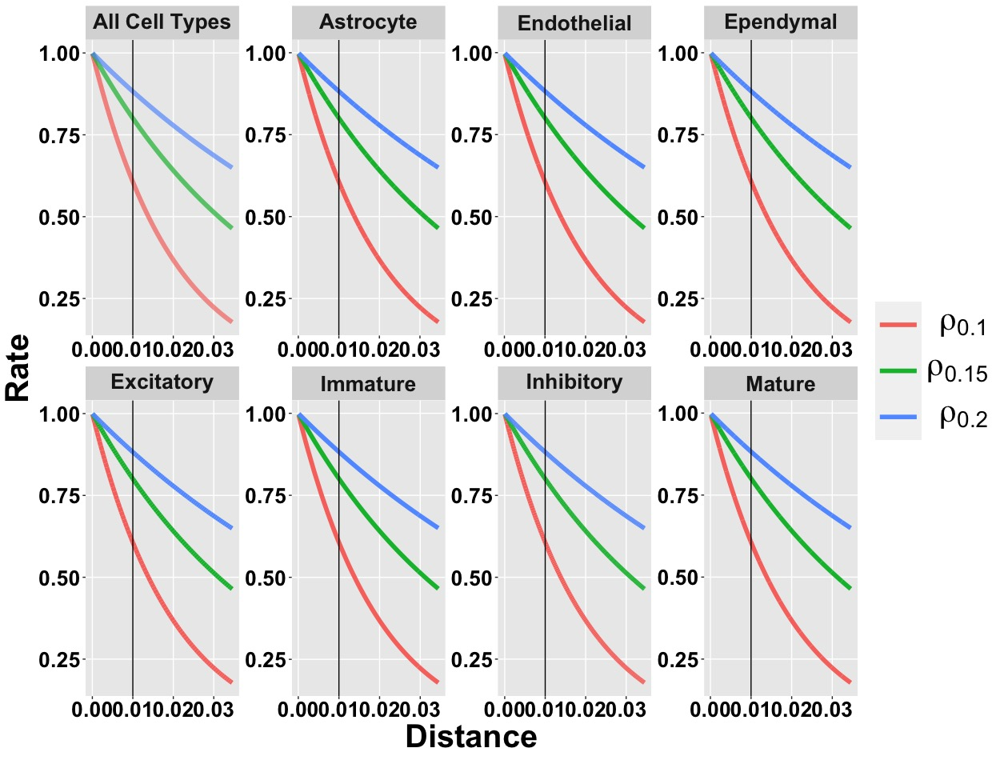
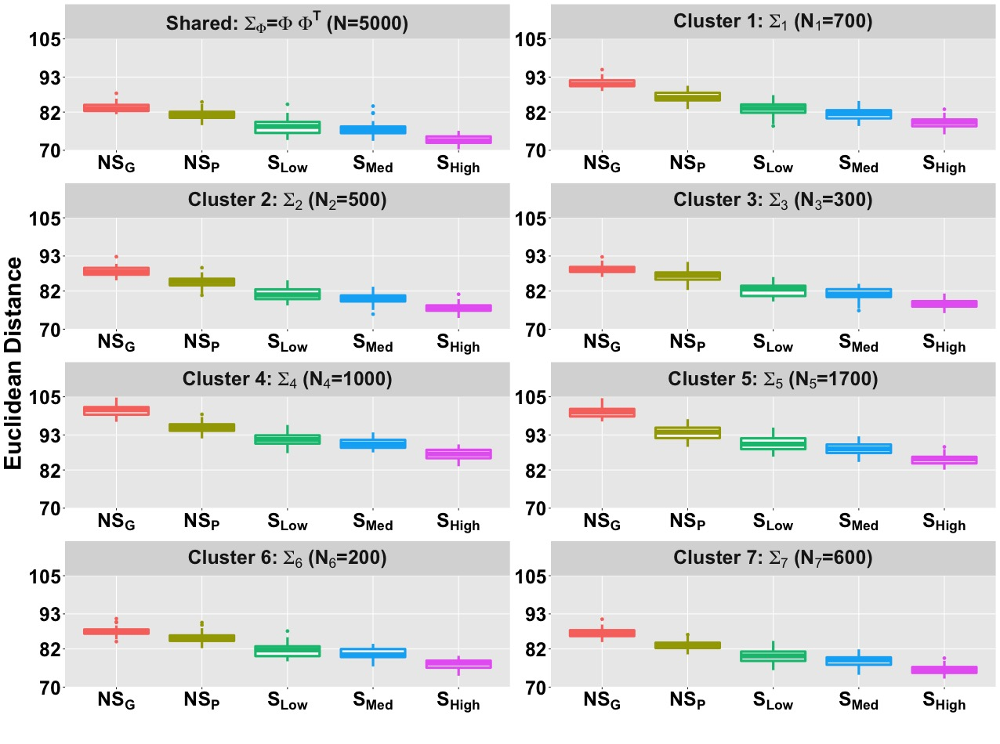
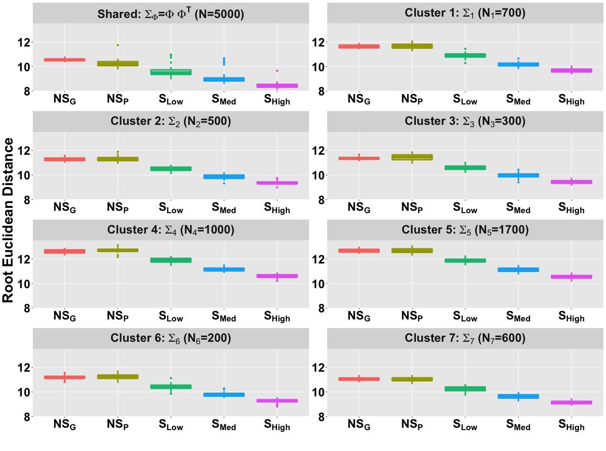
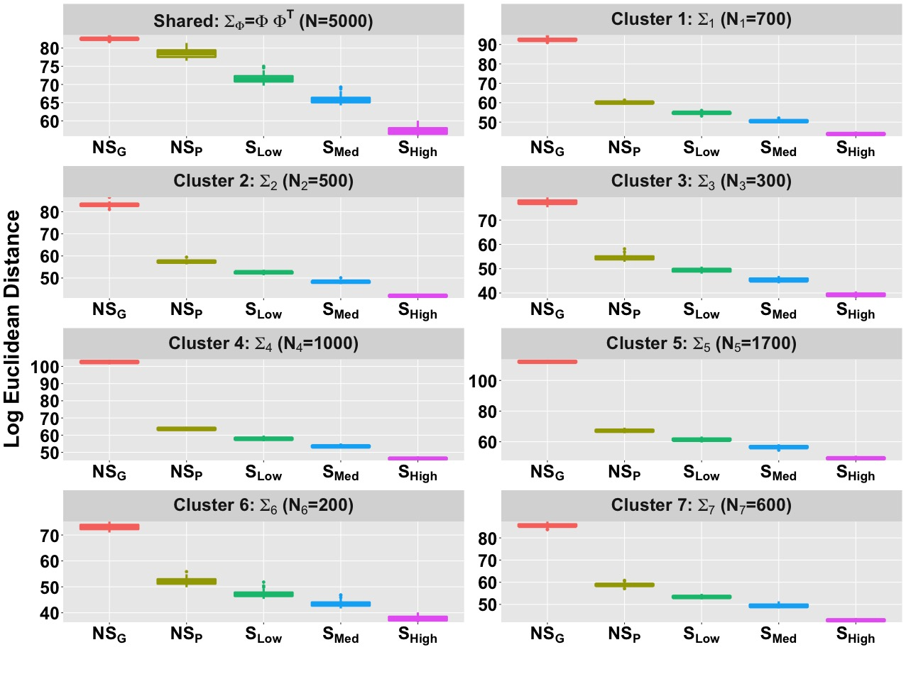
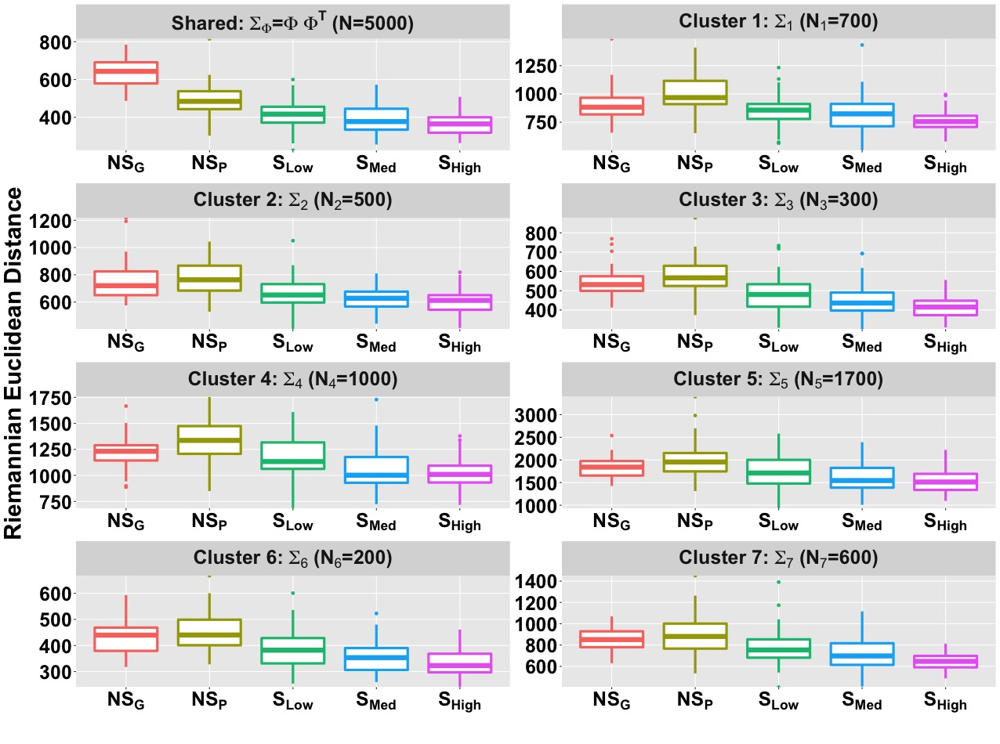
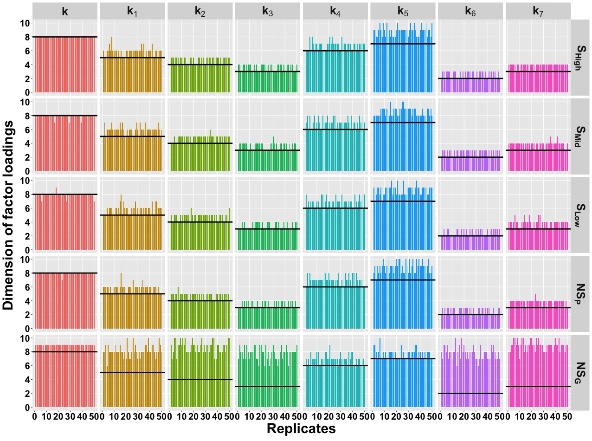
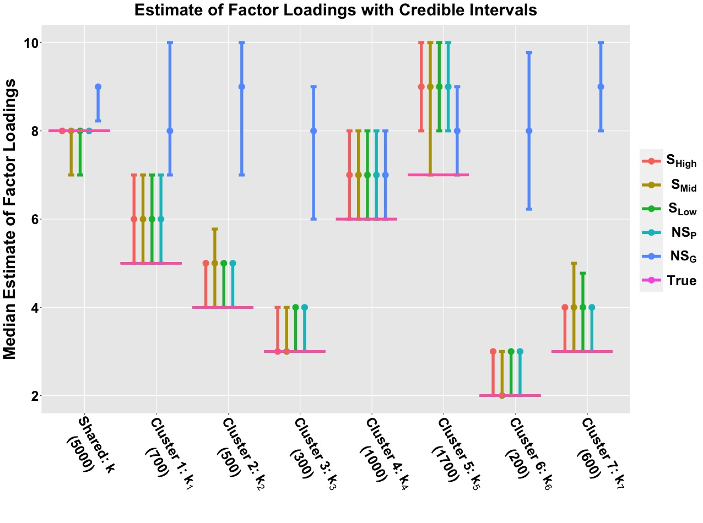

# Simulation Study {#simulation}

## Induced Correlation Study
In this section, we provide more details about the simulation study. First we consider $3$ different values of $\rho$ $(0.1,0.15,0.2)$ and make a induced correlation plot by using the squared exponential spatial kernel. The plots are generented for all cell types and cell type specific cases. The vertical line denotes the value of induced correlation at the distance $0.01$. For example the induced spatial correlations for all cell types (first figure of \@ref(fig:induceCORR)) w.r.t. $0.01$ distance are $0.88$, $0.80$, $0.61$ for $\text S_{\text High}$ ($\rho = 0.2$), $\text S_{\text Med}$ ($\rho = 0.15$), $\text S_{\text Low}$ ($\rho = 0.1$) methods respectively. 

```{r induceCORR,echo=F, fig.cap='Induced correlation plot for the Merfish data', out.width='80%', fig.asp=0.6, fig.align='center'}

```

## Comparative analysis with different norm measures
We consider the simulation setting discussed in the section 3 of the manuscript. The $5$  different methods are compared w.r.t. different norms other than **RV coefficent** [@robert1976unifying]. The **RV coefficent** between two matrices $S_{1}$ and $S_{2}$ is defined as $$\text{RV}(S_{1},S_{2}) = \frac{ tr(  S_{1}^{T} S_{2} ) }{ \sqrt{ tr(  S_{1}^{T} S_{1} )  tr(  S_{2}^{T} S_{2} ) }  }.$$ We consider 4 different norms:

I. **Euclidean or Frobenius** 
$$
d_{E}(S_{1},S_{2}) = \mid \mid S_{1} - S_{2} \mid \mid, 
$$
II. **Log-Euclidean**
$$
d_{L}(S_{1},S_{2}) = \mid \mid \log(S_{1}) - \log(S_{2}) \mid \mid,
$$
III. **Root Euclidean** 
$$
d_{H}(S_{1},S_{2}) = \mid \mid S_{1}^{1/2} - S_{2}^{1/2} \mid \mid, 
$$

IV. **Riemanian** 
$$
d_{R}(S_{1},S_{2}) = \mid \mid S_{1}^{-1/2} S_{2} S_{1}^{-1/2} \mid \mid.
$$

Figure \@ref(fig:Euclid), \@ref(fig:RootEuclid), \@ref(fig:LogEuclid) and \@ref(fig:ReiEuclid) are boxplot of distances between true $(\Sigma_{True})$ and estimated $(\Sigma_{Est})$ covariance matrices where the distances are measured in Euclidean, root Euclidean, log Euclidean and Riemanian norms [@dryden2009non] respectively. In all the norms we observe that spatial settings are performing better in terms of estimation than the no-spatial settings. Among the spatial settings the estimation accuracy increase with an increment in induced spatial correlation.     

```{r Euclid,echo=F, fig.cap="Boxplot of **Euclidean** distance $d_E(\\Sigma_{True}, \\Sigma_{Est})$ across  $50$ replicates for $\\Sigma_{\\Phi} = \\Phi \\Phi^{T}$ and $\\Sigma_{l}$ $(l = 1, \\dots , L)$. We compare the Euclidean distance for different method settings.", out.width='80%', fig.asp=0.6, fig.align='center'}

```


```{r RootEuclid,echo=F, fig.cap="Boxplot of **root Euclidean** distance $d_{H}(\\Sigma_{True}, \\Sigma_{Est})$ across  $50$ replicates for $\\Sigma_{\\Phi} = \\Phi \\Phi^{T}$ and $\\Sigma_{l}$ $(l = 1, \\dots , L)$. We compare the root Euclidean distance for different method settings.", out.width='80%', fig.asp=0.6, fig.align='center'}

```


```{r LogEuclid,echo=F, fig.cap="Boxplot of **log Euclidean** distance $d_{L}( \\Sigma_{True}, \\Sigma_{Est})$ across  $50$ replicates for $\\Sigma_{\\Phi} = \\Phi \\Phi^{T}$ and $\\Sigma_{l}$ $(l = 1, \\dots , L)$. We compare the log Euclidean distance for different method settings.", out.width='80%', fig.asp=0.6, fig.align='center'}

```


```{r ReiEuclid,echo=F, fig.cap="Boxplot of **Riemanian** distance $d_{R}( \\Sigma_{True}, \\Sigma_{Est})$ across  $50$ replicates for $\\Sigma_{\\Phi} = \\Phi \\Phi^{T}$ and $\\Sigma_{l}$ $(l = 1, \\dots , L)$. We compare the Riemanian distance for different method settings.", out.width='80%', fig.asp=0.6, fig.align='center'}

```

## Estimation of latent factors
We follow same procedure from section 3.3 of @de2018bayesian to estimate shared and cluster specific number of factors i.e. $K$ and $K_{c}$ $(c=1,2, \dots C)$. Figure \@ref(fig:factor1) shows shared and cluster specfic estimated factor loadings accross $50$ replicates for $5$ different methods. Figure \@ref(fig:factor2) shows the median estimate of shared and cluster specfic factor loadings for $5$ different methods. From both figures one can observe that spatial settings are estimating the loadings more precisely than the non-spatial settings.  

```{r factor1,echo=F, fig.cap="Estimated dimension of factor loadings for shared and cluster specific cases accross $50$ replicates. Black solid line denotes the true dimensions.", out.width='80%', fig.asp=0.6, fig.align='center'}

```


```{r factor2,echo=F, fig.cap="Estimated Factor loadings with credible intervals.", out.width='80%', fig.asp=0.6, fig.align='center'}

```


