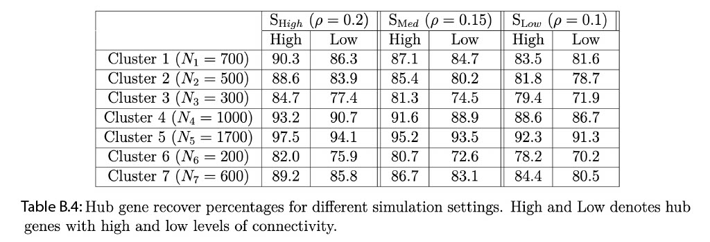

# Simulation Study {#simulation}

## Induced Correlation Study
In this section, we provide more details about the simulation study. First we consider $3$ different values of $\rho$ $(0.1,0.15,0.2)$ and make a induced correlation plot by using the squared exponential spatial kernel. The plots are generented for all cell types and cell type specific cases. The vertical line denotes the value of induced correlation at the distance $0.01$. For example the induced spatial correlations for all cell types (first Figure of \@ref(fig:induceCORR)) w.r.t. $0.01$ distance are $0.88$, $0.80$, $0.61$ for $\text S_{\text High}$ ($\rho = 0.2$), $\text S_{\text Med}$ ($\rho = 0.15$), $\text S_{\text Low}$ ($\rho = 0.1$) methods respectively. 

```{r induceCORR,echo=F, fig.cap='Induced correlation plot for the Merfish data', out.width='80%', fig.asp=0.6, fig.align='center'}
knitr::include_graphics("images/Merfish_induced_correlation_final.jpeg")
```

**Estimation of parameter $\rho$ :**
We adapt the steps from the section 1.1 of supplementary information of @sun2020statistical to estimate the length scale parameter of the spatial kernel $\rho_{c}$ based on several grid points. The estimation procedure of $\rho_{c}$ uses the pair-wise distances among spatial locations in the data to ensure scale-invariance. First the maximum $(m_{1})$ and minimum $(m_{2})$ value of those pairwise spatial distances are obtained. Next, equidistant $L$ points are identified in the range from $\text{log}(m_{1}/2)$ to $\text{log}(m_{2}*2)$. In our case, we consider $L=10$ as a default value for all our simulations and spatial transcriptomics data applications.  We consider the middle value of those $10$ grid points as the estimate of $\rho_{c}$. Table \@ref(tab:rhoest) shows the true and estimated values of $\rho_{c}$ which shows the grid points based estimation procedure is effective. 

<table>
<thead>
<tr>
  <td>True value of $\rho_{c}$</td>
  <td>0.2</td>
  <td>0.15</td>
  <td>0.1</td>
</tr>
</thead>
<tbody>
<tr>
  <td>Estimated value of $\rho_{c}$</td>
  <td>0.18</td>
  <td>0.16</td>
  <td>0.11</td>
</tr>
<tr>
  <td>Standard Errors</td>
  <td>0.11</td>
  <td>0.13</td>
  <td>0.14</td>
</tr>
</tbody>
<caption style='caption-side: bottom'>
(#tab:rhoest) True, estimated values and standard errors of $\rho_{c}$. </caption>
</table>

## Data generation with spatial correlation
**Simulation Design**: The details of the simulation design is provided in section 3 of the paper.

**Comparative Models**: We discussed the $5$ comparative models in section 3 of the paper. A summary of the comparative models is provided in Table \@ref(tab:differentmodeloverview) 


<table>
<thead>
<tr>
  <th> </th>
  <th>SpaceX model</th>
  <th>Non-spatial Poisson model</th>
  <th>Gaussian model</th>
</tr>
</thead>
<tbody>
<tr>
  <th>Spatial information</th>
  <th>$\checkmark$</th>
  <th> X </th>
  <th> X </th>
</tr>
<tr>
  <th>Poisson likelihood</th>
  <th> $\checkmark$ </th>
  <th> $\checkmark$ </th>
  <th> X </th>
</tr>
<tr>
  <th>Gaussian likelihood</th>
  <th>X</th>
  <th>X</th>
  <th>$\checkmark$</th>
</tr>
</tbody>
<caption style='caption-side: bottom'>
(#tab:differentmodeloverview) Overview of comparative models. </caption>
</table>

**Metrics for comparison**: To measure the co-expression estimation accuracy, we use the following metrics in Table \@ref(tab:Normtable) such as RV coefficient [@robert1976unifying] and 4 Euclidean distance based norms (**Frobenius, Log-Euclidean, Root Euclidean, Riemanian**, @dryden2009non) as defined in Table \@ref(tab:Normtable). These metrics are used to quantify the similarity between true and estimated covariance (co-expression) matrices. RV values close to $1$ ($0$) implying  higher (lower) level of similarity. For rest of the norms on Table \@ref(tab:Normtable), values closer to $0$ indicates higher level of similarity between true and estimated matrices. 


<table>
<thead>
<tr>
  <td> Name </td>
  <td>$$ \text{Notation} $$</td>
  <td>$$ \text{Form} $$</td>
</tr>
</thead>
<tbody>
<tr>
  <td>RV</td>
  <td> $$ \text{RV}(S_{1},S_{2}) $$ </td>
  <td> $$\frac{ tr(  S_{1}^{T} S_{2} ) }{ \sqrt{ tr(  S_{1}^{T} S_{1} )  tr(  S_{2}^{T} S_{2} ) }  } $$ </td>
</tr>
<tr>
  <td>Euclidean (Frobenius)</td>
  <td> $$ d_{E}(S_{1},S_{2}) $$ </td>
  <td> $$\mid \mid S_{1} - S_{2} \mid \mid $$ </td>
</tr>
<tr>
  <td>Log-Euclidean</td>
  <td> $$d_{L}(S_{1},S_{2})$$ </td>
  <td>  $$\mid \mid \log(S_{1}) - \log(S_{2}) \mid \mid $$ </td>
</tr>
<tr>
  <td>Root-Euclidean</td>
  <td> $$d_{H}(S_{1},S_{2})$$ </td>
  <td> $$\mid \mid S_{1}^{1/2} - S_{2}^{1/2} \mid \mid $$ </td>
</tr>
<tr>
  <td>Riemanian</td>
  <td> $$d_{R}(S_{1},S_{2})$$ </td>
  <td> $$\mid \mid S_{1}^{-1/2} S_{2} S_{1}^{-1/2} \mid \mid $$ </td>
</tr>
</tbody>
<caption style='caption-side: bottom'>
(#tab:Normtable) Definition of different norms. Here $\mid \mid X \mid \mid = \sqrt{\text{trace}(X^{T}X)}$. </caption>
</table>


### Comparative analysis with different norm measures
<!-- We consider the simulation setting discussed in the section 3 of the manuscript. The $5$  different methods are compared w.r.t. different norms other than **RV coefficent** [@robert1976unifying]. The **RV coefficent** between two matrices $S_{1}$ and $S_{2}$ is defined as $$\text{RV}(S_{1},S_{2}) = \frac{ tr(  S_{1}^{T} S_{2} ) }{ \sqrt{ tr(  S_{1}^{T} S_{1} )  tr(  S_{2}^{T} S_{2} ) }  }.$$ We consider 4 different norms: -->

<!-- I. **Euclidean or Frobenius**  -->
<!-- $$ -->
<!-- d_{E}(S_{1},S_{2}) = \mid \mid S_{1} - S_{2} \mid \mid,  -->
<!-- $$ -->
<!-- II. **Log-Euclidean** -->
<!-- $$ -->
<!-- d_{L}(S_{1},S_{2}) = \mid \mid \log(S_{1}) - \log(S_{2}) \mid \mid, -->
<!-- $$ -->
<!-- III. **Root Euclidean**  -->
<!-- $$ -->
<!-- d_{H}(S_{1},S_{2}) = \mid \mid S_{1}^{1/2} - S_{2}^{1/2} \mid \mid,  -->
<!-- $$ -->

<!-- IV. **Riemanian**  -->
<!-- $$ -->
<!-- d_{R}(S_{1},S_{2}) = \mid \mid S_{1}^{-1/2} S_{2} S_{1}^{-1/2} \mid \mid. -->
<!-- $$ -->

Figure \@ref(fig:AllEuclid) represents the boxplot of distances between true $(\Sigma_{True})$ and estimated $(\Sigma_{Est})$ covariance matrices where the distances are measured in **Euclidean, root Euclidean, log Euclidean and Riemanian** norms respectively. In all the norms we observe that spatial settings are performing better in terms of estimation than the no-spatial settings. Among the spatial settings the estimation accuracy increase with an increment in induced spatial correlation.     

```{r AllEuclid,echo=F, fig.cap=" **Comparison of different methods based on several norms for estimation of gene co-expression in simulation study while the data is generated from a spatially correlated setting**. Boxplot of Euclidean, log-Euclidean,  root-Euclidean, Riemannian distance (Figure A, B, C and D respectively) across  $50$ replicates for $\\Sigma_{\\Phi} = \\Phi \\Phi^{T}$ and $\\Sigma_{l}$ $(l = 1, \\dots , L)$. We compare the norm distances for different settings for data generation with spatial correlation.", out.width='80%', fig.asp=0.6, fig.align='center'}
knitr::include_graphics("images/Norm_plot_rev.jpg")
```

<!-- ```{r Euclid,echo=F, fig.cap="Boxplot of **Euclidean** distance $d_E(\\Sigma_{True}, \\Sigma_{Est})$ across  $50$ replicates for $\\Sigma_{\\Phi} = \\Phi \\Phi^{T}$ and $\\Sigma_{l}$ $(l = 1, \\dots , L)$. We compare the Euclidean distance for different method settings.", out.width='80%', fig.asp=0.6, fig.align='center'} -->
<!-- knitr::include_graphics("images/Distance_Euclidean_plot.jpeg") -->
<!-- ``` -->


<!-- ```{r RootEuclid,echo=F, fig.cap="Boxplot of **root Euclidean** distance $d_{H}(\\Sigma_{True}, \\Sigma_{Est})$ across  $50$ replicates for $\\Sigma_{\\Phi} = \\Phi \\Phi^{T}$ and $\\Sigma_{l}$ $(l = 1, \\dots , L)$. We compare the root Euclidean distance for different method settings.", out.width='80%', fig.asp=0.6, fig.align='center'} -->
<!-- knitr::include_graphics("images/Root_Euclidean_plot.jpeg") -->
<!-- ``` -->


<!-- ```{r LogEuclid,echo=F, fig.cap="Boxplot of **log Euclidean** distance $d_{L}( \\Sigma_{True}, \\Sigma_{Est})$ across  $50$ replicates for $\\Sigma_{\\Phi} = \\Phi \\Phi^{T}$ and $\\Sigma_{l}$ $(l = 1, \\dots , L)$. We compare the log Euclidean distance for different method settings.", out.width='80%', fig.asp=0.6, fig.align='center'} -->
<!-- knitr::include_graphics("images/Log_Euclidean_plot.jpeg") -->
<!-- ``` -->


<!-- ```{r ReiEuclid,echo=F, fig.cap="Boxplot of **Riemanian** distance $d_{R}( \\Sigma_{True}, \\Sigma_{Est})$ across  $50$ replicates for $\\Sigma_{\\Phi} = \\Phi \\Phi^{T}$ and $\\Sigma_{l}$ $(l = 1, \\dots , L)$. We compare the Riemanian distance for different method settings.", out.width='80%', fig.asp=0.6, fig.align='center'} -->
<!-- knitr::include_graphics("images/Rei_Euclidean_plot.jpeg") -->
<!-- ``` -->

### Estimation of latent factors
We follow same procedure from section 3.3 of @de2018bayesian to estimate shared and cluster specific number of factors i.e. $K$ and $K_{c}$ $(c=1,2, \dots C)$. Figure \@ref(fig:factor1) shows shared and cluster specfic estimated factor loadings accross $50$ replicates for $5$ different methods. Figure \@ref(fig:factor2) shows the median estimate of shared and cluster specfic factor loadings for $5$ different methods. From both figures one can observe that spatial settings are estimating the loadings more precisely than the non-spatial settings.  

```{r factor1,echo=F, fig.cap="Estimated dimension of factor loadings for shared and cluster specific cases accross $50$ replicates. Black solid line denotes the true dimensions.", out.width='80%', fig.asp=0.6, fig.align='center'}
knitr::include_graphics("images/Loading_Dimension_plot.jpeg")
```


```{r factor2,echo=F, fig.cap="Estimated Factor loadings with credible intervals.", out.width='80%', fig.asp=0.6, fig.align='center'}
knitr::include_graphics("images/Median_Loading_plot.jpeg")
```

## Data generation with no spatial correlation

**Simulation design**:
We consider the same simulation design, comparative models and metrics for comparison. Now, we generate the from $\text NS_{\text P}$ model where we do not consider any spatial correlation. We model the spatial parameter with a multi-variate normal distribution with mean $0$ and identity as covariance matrix. We generate the data with no spatial correlation model $\text NS_{\text P}$ and fit all the comparative models as mentioned in Table \@ref(tab:differentmodeloverview). We summarize our results based on $50$ replicated simulation study w.r.t co-expression estimation and network recovery. 

**Co-expression estimation:**
We display the boxplot of RV coefficients for shared ($\bf G_{s}$) and cluster-specific ($\bf G_{c}$, $c=1, \dots, C$) covariance matrices in Figure \@ref(fig:nullsimulationRVAUC)A across 3 comparative models in Table \@ref(tab:differentmodeloverview). Based on RV coefficients, the highest level of precision in estimation is obtained for the non-spatial setting in (IV) i.e.  $\text NS_{\text P}$. For spatial settings, we do not observe a significant loss in estimation accuracy. For example, we only loose 1.3\% accuracy in estimation for spatial settings with the SpaceX method in case of the shared network. A similar inference can be drawn based on different norm measures (Euclidean, log-Euclidean, root-Euclidean, Riemannian as defined in Table \@ref(tab:Normtable) as provided in Figure \@ref(fig:nullsimulationnorm) (in clock-wise manner). 


**Network recovery:** AUC based comparisons for shared and cluster specific networks are shown in Figure \@ref(fig:nullsimulationRVAUC)B. The Figure leads us to infer that no significant reduction in network recovery while comparing the spatial and non-spatial settings while data is generated without spatial correlation. 

**In summary**, we do not observe a significant loss in precision while applying the SpaceX model to the simulated data without any spatial correlation.


```{r nullsimulationRVAUC,echo=F, fig.cap=" **Accuracy comparison of different methodological settings in estimation and recovery of gene co-expression networks in simulation study while the data is generated without any spatial correlation. A)** The RV coefficient measures the distance between the true and estimated networks. In the left panel, we have boxplot of RV coefficients across $50$ replicates for shared and cluster-specific networks. We compare the RV coefficients for 3 different methods (I) SpaceX, (IV) $\\text NS_{\\text P}$ ($\\rho = 0$) and (V) $\\text NS_{\\text G}$ (the PMM and spatial informations are not taken under consideration). **B) In the right panel**, we use AUC metric as a measure of network recovery. The Figure represents ROC curves with color-coded AUC values of networks for different settings except for $\\text NS_{\\text G}$ method.", fig.asp=0.8, fig.align='center'}
knitr::include_graphics("images/Null_sim_RV_ROC.jpg")
```


```{r nullsimulationnorm,echo=F, fig.cap=" **Comparison of different methods based on several norms for estimation of gene co-expression in simulation study while the data is generated without any spatial correlation**. Boxplot of Euclidean, log-Euclidean, root-Euclidean, Riemannian distances (Figure A, B, C and D respectively) across  $50$ replicates for $\\Sigma_{\\Phi} = \\Phi \\Phi^{T}$ and $\\Sigma_{l}$ $(l = 1, \\dots , L)$. We provide the definitions of all the norms in Table \\@ref(tab:Normtable) and compare the distances for different methodological settings.",  fig.asp=0.8, fig.align='center'}
knitr::include_graphics("images/Null_sim_norm.jpg")
```

<!-- \textbf{Comparison of different methods based on several norms for estimation of gene co-expression in simulation study while the data is generated without any spatial correlation}. Boxplot of Euclidean, log-Euclidean, root-Euclidean, Riemannian distances (Figure A, B, C and D respectively) across  $50$ replicates for $\Sigma_{\Phi} = \Phi \Phi^{T}$ and $\Sigma_{l}$ $(l = 1, \dots , L)$. We provide the definitions of all the norms in Table \eqref{Norm_table} and compare the distances for different methodological settings. -->


## Hub gene detection based simulation
Given the lack of ground truth for real data, we used a simulation study mimicking the real data structure, to evaluate the accuracy of the SpaceX method to recover true hub genes. To this end, we generate the data consisting of $160$ genes and $5000$ locations with $7$ clusters; additional design parameters and details  about the simulation settings are provided in Section 3 of the paper. Next, we apply our SpaceX model to the simulated data to estimate the hub genes for each of the $7$ spatial clusters. We classify the hub gene into two categories: one with more than 40\% connectivity (named  "High") and another with less than 40\% connectivity (named "Low"). We choose this cut-off based on degree connectivity we found in the real data example (Section 4). Table B.4 shows the percentage of hub gene recovered for each cluster by setting $3$ different values of the spatial correlation parameter: $\rho = 0.2, 0.15$ and $0.1$ corresponding to low, medium and high levels of spatial correlation. The denominator of recovery rate is the total number of hub genes calculated from the true simulation settings whereas the numerator denotes the estimated number of hub genes obtained from the SpaceX method. From Table B.4, we observe that the percentage hub gene recovery increases with an increase as the  level of spatial correlations increase $\rho$ and size of the cluster. For example, cluster 5 (size = 1700) has the following recovery rates 97.5\% , 95.2\%, 92.3\% for highly connected hub genes corresponding to different level of spatial correlations i.e. $\rho = 0.2,0.15$ and $0.1$ respectively. The recovery rates are 97.5\%, 93.2\%, 90.3\% for cluster 5, 4 and 1 respectively with different cluster sizes ($N_{5}=1700$, $N_{4}=1000$, $N_{1}=700$). As expected, the recovery rate of the hub genes with higher connectivity is more than in the ones with low connectivity.

```{r table6,echo=F,  out.width='110%', fig.align='center'}

```


