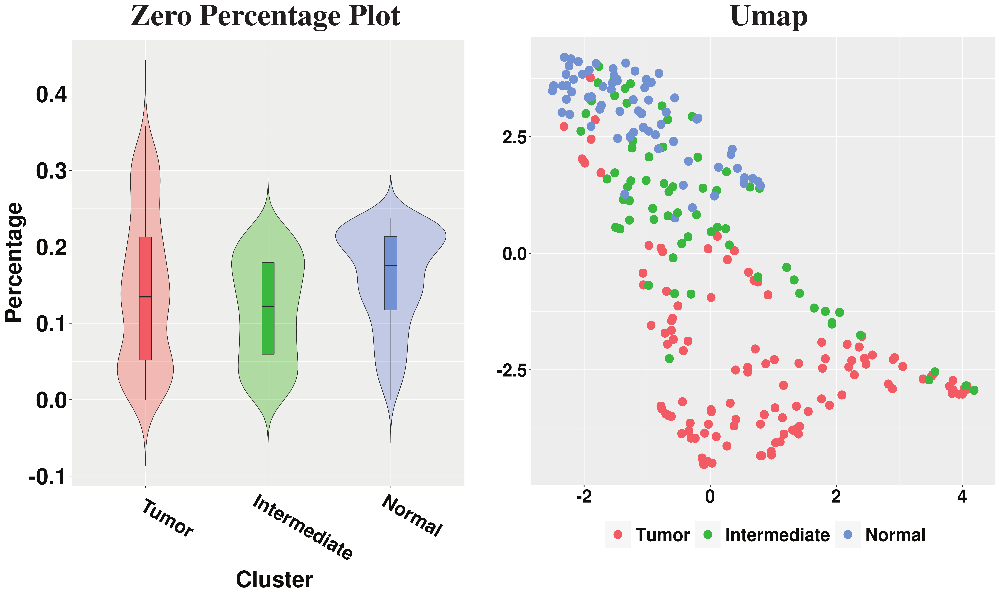
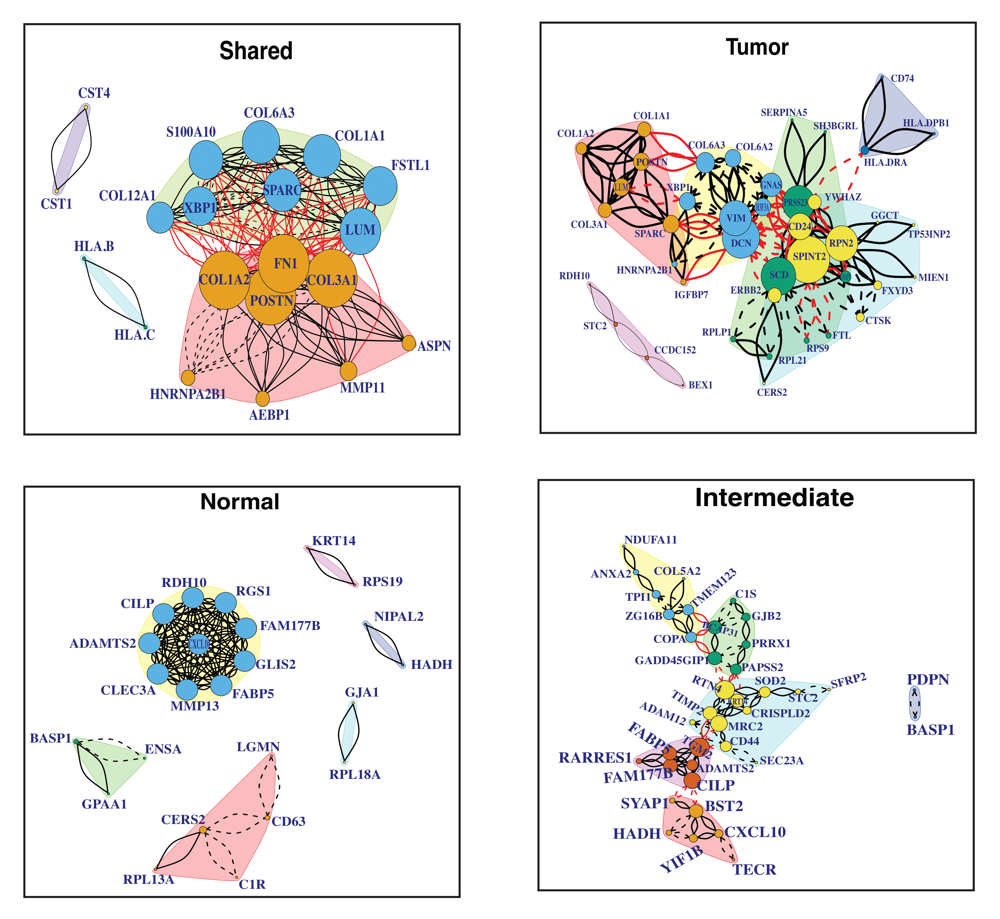

# Real Data Analysis {#realdata}

We applied the SpaceX method on two spatial transcriptomics datasets which are obtained from the preoptic region of the mouse hypothalamus  [@Moffitteaau5324] and the human breast cancer dataset [@staahl2016visualization]. Here we provide details of preprocessing and exploratory analysis of both datasets in section \@ref(exploratory). We illustrate the detailed application of the community detection algorithm on those two datasets in section \@ref(communitydetection).


## Exploratory analysis of the datasets {#exploratory}

### Merfish Data
The MERFISH dataset is obtained from the preoptic area of the mouse hypothalamus [@Moffitteaau5324]. The dataset consists of $160$ genes and corresponding gene expressions are measured in $4975$ spatial locations. There are $7$ pre-determined spatial clusters in the dataset named Astrocyte, Endothelial, Ependymal, Excitatory, Inhibitory, Immature, Mature, and the corresponding sizes are $724$, $503$, $314$, $1024$, $1694$, $168$, $385$ respectively. The dataset consists of $2$ more clusters named Microglia, Pericytes with cluster sizes $90$, $73$ respectively which are less than $100$. Those two clusters are removed from the dataset. After removing those two clusters, we have gene expressions from $4812$ locations corresponding to $160$ genes. There are no genes with more than $95\%$ zeros reads. The left panel of Figure \@ref(fig:zeroperMF) shows the violin plot of the percentage of zero reads among the genes for each cluster in the MERFISH dataset. The Umap representation of the Merfish data has been provided on the right panel of Figure \@ref(fig:zeroperMF).

```{r zeroperMF,echo=F, fig.cap='Left panel shows the violin plot of percentage of zero reads among the genes for each cluster w.r.t. Merfish data and the right panel shows the Umap.', out.width='90%', fig.asp=0.6, fig.align='center'}
knitr::include_graphics("images/Merfish_zero_umap.jpg")
```


### Breast Cancer Data 
The human breast cancer dataset contains expression levels from $5262$ genes measured at $250$ locations [@staahl2016visualization]. We use the SPARK method with $5\%$ FDR cut-off on p-values to detect $290$ spatially expressed genes to carry forward our analysis. The violin plot of the percentage of zero reads among the genes for each spatially contiguous cluster in the Breast cancer dataset is shown in the left panel of Figure \@ref(fig:BCperzero). On the right panel of Figure \@ref(fig:BCperzero), we have provided the Umap. 

```{r BCperzero,echo=F, fig.cap='On the left panel, we have violin plot of percentage of zero reads among the genes for each cluster w.r.t. Breast Cancer data and the Umap is shown on the right panel.', out.width='80%', fig.asp=0.6, fig.align='center'}

```

## Community detection {#communitydetection}

The community detection is a downstream analysis of the shared and cluster-specific networks which are obtained from the SpaceX method. The communities are detected by optimizing modularity over partitions in a network structure [@brandes2007modularity]. Figure \@ref(fig:comMERFISH) and \@ref(fig:comBC) show the detected community modules from shared and cluster-specific co-expression networks for MERFISH and breast cancer data respectively.  

```{r comMERFISH, echo=F, fig.cap='Shared and cell-type specific community detection for Merfish data', out.width='95%', fig.asp=0.8, fig.align='center'}
knitr::include_graphics("images/merfishCom.png")
```


```{r comBC, echo=F, fig.cap='Shared and cell-type specific community detection for Breast cancer data', out.width='80%', fig.asp=.75, fig.align='center'}

```

## List of hub genes and edges
A detailed list of hub genes and top edges for both the datasets can be found at https://github.com/SatwikAch/SpaceX.


