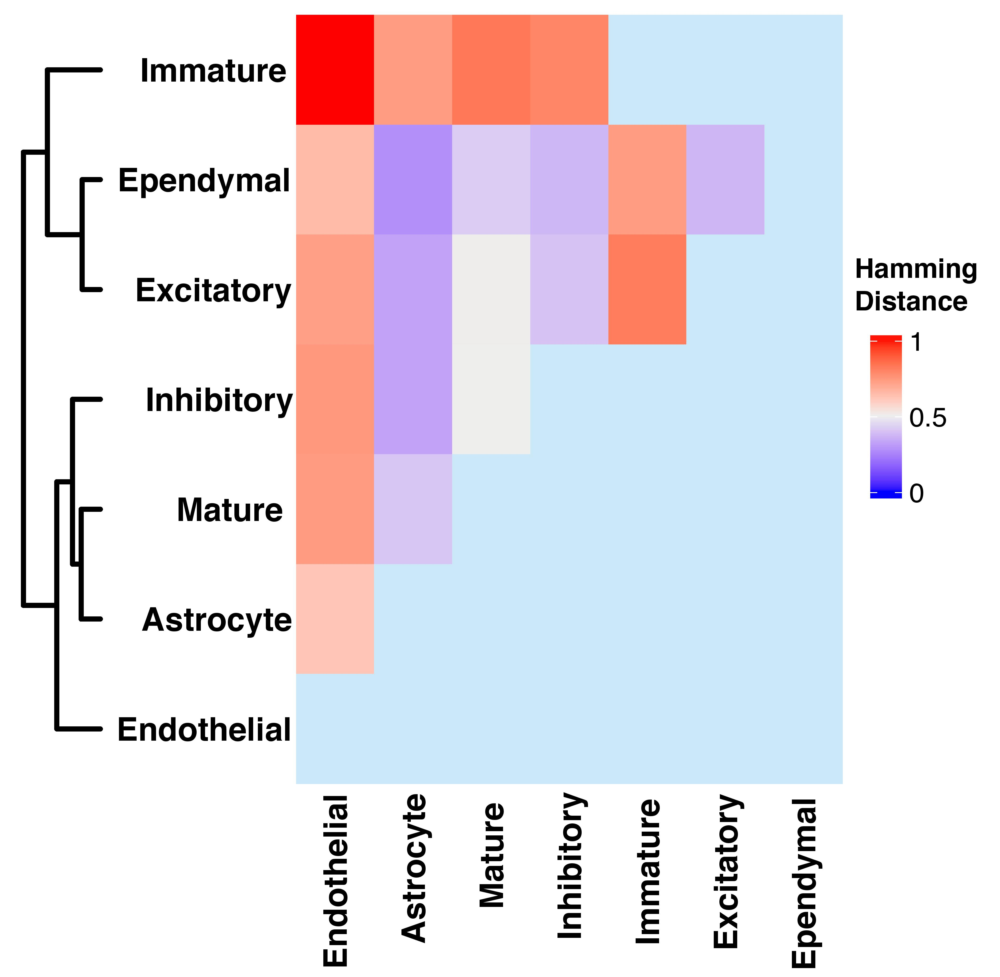

# Real Data Analysis {#realdata}

We applied the SpaceX method on two spatial transcriptomics datasets which are obtained from the preoptic region of the mouse hypothalamus  [@Moffitteaau5324] and the human breast cancer dataset [@staahl2016visualization]. Here we provide details of preprocessing and exploratory analysis of both datasets in section \@ref(exploratory). We illustrate the detailed application of the community detection algorithm on those two datasets in section \@ref(communitydetection).


## Exploratory analysis of the datasets {#exploratory}

### Merfish Data
The MERFISH dataset is obtained from the preoptic area of the mouse hypothalamus [@Moffitteaau5324]. The dataset consists of $160$ genes and corresponding gene expressions are measured in $4975$ spatial locations. There are $7$ pre-determined spatial clusters in the dataset named Astrocyte, Endothelial, Ependymal, Excitatory, Inhibitory, Immature, Mature, and the corresponding sizes are $724$, $503$, $314$, $1024$, $1694$, $168$, $385$ respectively. The dataset consists of $2$ more clusters named Microglia, Pericytes with cluster sizes $90$, $73$ respectively which are less than $100$. Those two clusters are removed from the dataset. After removing those two clusters, we have gene expressions from $4812$ locations corresponding to $160$ genes. There are no genes with more than $95\%$ zeros reads. The left panel of Figure \@ref(fig:zeroperMF) shows the violin plot of the percentage of zero reads among the genes for each cluster in the MERFISH dataset. The Umap representation of the Merfish data has been provided on the right panel of Figure \@ref(fig:zeroperMF).

```{r zeroperMF,echo=F, fig.cap='Left panel shows the violin plot of percentage of zero reads among the genes for each cluster w.r.t. Merfish data and the right panel shows the Umap.', out.width='90%', fig.asp=0.6, fig.align='center'}
knitr::include_graphics("images/Merfish_zero_umap.jpg")
```


### Breast Cancer Data 
The human breast cancer dataset contains expression levels from $5262$ genes measured at $250$ locations [@staahl2016visualization]. We use the SPARK method with $5\%$ FDR cut-off on p-values to detect $290$ spatially expressed genes to carry forward our analysis. The violin plot of the percentage of zero reads among the genes for each spatially contiguous cluster in the Breast cancer dataset is shown in the left panel of Figure \@ref(fig:BCperzero). On the right panel of Figure \@ref(fig:BCperzero), we have provided the Umap. 

```{r BCperzero,echo=F, fig.cap='On the left panel, we have violin plot of percentage of zero reads among the genes for each cluster w.r.t. Breast Cancer data and the Umap is shown on the right panel.', out.width='80%', fig.asp=0.6, fig.align='center'}
knitr::include_graphics("images/BC_zero_umap.jpg")
```

## Community detection {#communitydetection}

The community detection is a downstream analysis of the shared and cluster-specific networks which are obtained from the SpaceX method. The communities are detected by optimizing modularity over partitions in a network structure [@brandes2007modularity]. Figure \@ref(fig:comMERFISH) and \@ref(fig:comBC) show the detected community modules from shared and cluster-specific co-expression networks for MERFISH and breast cancer data respectively.  

```{r comMERFISH, echo=F, fig.cap='Shared and cell-type specific community detection for Merfish data', out.width='95%', fig.asp=0.8, fig.align='center'}
knitr::include_graphics("images/merfishCom.png")
```


```{r comBC, echo=F, fig.cap='Shared and cell-type specific community detection for Breast cancer data', out.width='80%', fig.asp=.75, fig.align='center'}
knitr::include_graphics("images/BC_Com.png")
```


## Benchmarking on real spatial transcriptomics data 
In this section, we benchmark our models on two real spatial transcriptomics datasets based on model fitting criteria. To this end, we use information-based criteria -- a standard and well-established technique to compare the model fits between hierarchical Bayesian models [@gelman2014understanding]. In this case, we use two information criteria-based metrics to assess our model fitting: (i) Bayesian analogue of AIC [@akaike1998information], defined as the Bayesian information criteria (BIC, @watanabe2013widely); and (ii) Watanabe-Akaike  information criterion (WAIC) [@watanabe2010asymptotic], an improvement on the AIC and a fully Bayesian approach to measure model accuracy computed with log pointwise posterior predictive density and then adding a correction for the effective number of parameters to adjust for over-fitting.  These criterion based methods are often used for model selection and specifically for spatial datasets [@banerjee2003frailty;@banerjee2000geostatistical;@lee2009performance]. In both cases, lower (relative) values indicate better model fits. 


Table \@ref(tab:BICWAIC) shows the BIC and WAIC values for the SpaceX and non-spatial Poisson model for both the mouse hypothalamus and breast cancer data. Based on the criteria based values from the Table \@ref(tab:BICWAIC), we can conclude that the SpaceX model is a better fit to both spatial transcriptomics datasets than the non-spatial Poisson model. For example, there is 64.7\% and 46.6\% of relative gain in accuracy of model fitting of the SpaceX model and non-spatial model w.r.t. BIC and WAIC respectively in case of Merfish data. A similar inference can be drawn for the breast cancer data where the relative gains are 66.4\% and 45.5\% for BIC and WAIC respectively in case of model fitting.


<table>
<thead>
<tr>
  <td> </td>
  <td>BIC (Merfish)</td>
  <td>WAIC (Merfish)</td>
  <td>BIC (Breast cancer)</td>
  <td>WAIC (Breast cancer)</td>
</tr>
</thead>
<tbody>
<tr>
  <td>SpaceX Model </td>
  <td> 13520 </td>
  <td> 43783 </td>
  <td> 24346 </td>
  <td> 54179 </td>
</tr>
<tr>
  <td>Non-spatial Poisson model</td>
  <td> 38274 </td>
  <td> 82045 </td>
  <td> 72523 </td>
  <td> 99474 </td>
</tr>
</tbody>
<caption style='caption-side: bottom'>
(#tab:BICWAIC) Criteria based values for application of the SpaceX and non-spatial Poisson model to spatial transcriptomics data i.e. mouse hypothalamus and Breast cancer data. </caption>
</table>


## List of hub genes and edges
A detailed list of hub genes and top edges for both the datasets can be found at https://github.com/SatwikAch/SpaceX.

## Corroboration with TCGA Breast Cancer Data 
To corroborate some of our findings, we consider the TCGA-based gene expression from 67 breast cancer tissues and 20,000 genes using parallel high-throughput sequencing  [@wirth2011expression; @weinstein2013cancer]. To make a fair "apples-to-apples" comparison, we used the same intersecting gene set from the spatial transcriptomics based breast cancer data used in our paper \citep{staahl2016visualization}. We used a network-based algorithm: personalized cancer-specific integrated network estimation (PRECISE, @ha2018personalized) to obtain  gene networks. PRECISE is Bayesian method for gene-network reconstruction for bulk-sequencing data that uses a regression-based approach.  The PRECISE method detected $77$ hub genes out of total $290$ genes compared to the SpaceX method, which detected $59$ hub genes -- with $19$ intersecting hub genes using both methods. The list of all the hub genes detected from each method and intersection hub genes from both method can be found at the webiste mentioned below under the name **BC_Hub_genes_TCGA.csv** (https://github.com/SatwikAch/SpaceX/tree/main/Hub%20genes).


Interestingly, multiple collagens genes (COL16A1, COL6A2, COL5A1) are detected as hub genes by both methods. Collagen biosynthesis can be regulated by cancer cells through mutated genes, transcription factors and signaling pathways [@xu2019role]. Understanding of the structural properties and functions of collagen in cancer will lead to anticancer therapy. The LUM gene is associated with collagen genes and effectively regulates estrogen receptors and function properties of breast cancer cells [@karamanou2017lumican]. Upregulation in FN1 gene indicates development various types of tumors [@sun2020high]. XBP1 can induce cell invasion and metastasis in breast cancer cells by promoting high expression [@chen2020emerging]. VIM gene
is used as a biomarker for the early detection of cancer [@mohebi2020expression].


## Network similarity between cell-type specific networks 
We further evaluated the performance of SpaceX to detect similarity between cell-cell interactions. To this end, we used Hamming distance, a well-established similarity measure between two networks, which has been used in several network topology based research studies  [@tian2005hamming; @tian2006multicast;  @ehounou2020minimizing]. In our case, the Hamming distance is equivalent to the distance between their two co-expression networks, i.e., the number of elements having a similar (or different) values in each of the two networks.  A low (high) value in Hamming distance between two networks implies those two networks are more (less) similar to each other.


The mouse hypothalamus data consists of 7 cell-type based clusters among 4812 spatial locations. The SpaceX method provides gene co-expression networks specifically for each cell types. Using the Hamming distance as similarity metric, we measure the network similarity between cell-type specific networks obtained from the Mouse hypthalamaous data analyses in Section 4.1 of the paper. The heatmap of the Hamming distances between cell-type specific networks is shown in Figure \@ref(fig:hammDist). We can observe that the co-expression network of immature cell-type is further apart than other cell type specific network in terms of Hamming distance. We rescale the Hamming distance with maximum value such that the distances are in [0,1] interval. Specifically, the Hamming distances of immature cell type network with other cell type (Endothelial, Astrocyte, Mature, Inhibitory, Excitatory, Ependymal) networks are 1, 0.73, 0.83, 0.79, 0.82, 0.73 respectively. Based on Figure \@ref(fig:hammDist), network of endothelial cell type is  distant from other cell-type based networks except for the immature cell-type. The distance of Astrocyte cell-type netwrok from Ependymal and Excitatory are 0.27 and 0.32 respectively. The neuronal cell type specific networks have lower distance than others which leads to infer a higher level of similarity between cell-type based networks than others. This similarity and disparity based finding aligns with multiple prior works which discuss about hypothalamic cell diversity [@chen2017single; @mickelsen2020cellular]. 

```{r hammDist, echo=F, fig.cap='The Figure shows heatmap of Hamming distances between cell-type specific networks.', out.width='60%', fig.asp=0.5, fig.align='center'}

```
